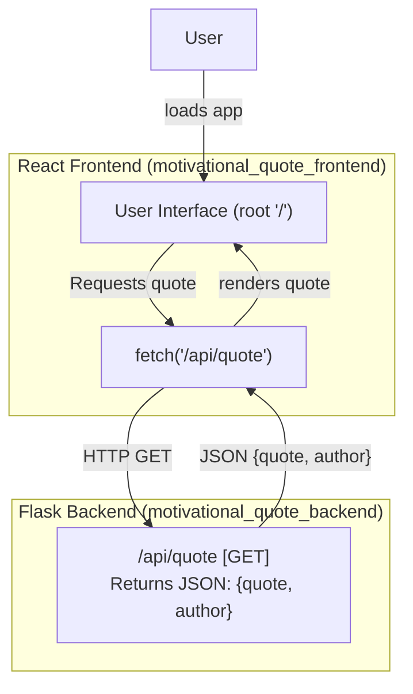

# System Architecture Overview: Motivational Quote App

This document describes the overall system architecture and data flow for the Motivational Quote application. The app is composed of two main components:

- **React Frontend**: Provides the user interface, rendering motivational quotes, and allows users to request new quotes on demand.
- **Flask Backend**: Exposes a REST API endpoint that serves a random motivational quote from a predefined list.

The interaction between these components centers around the `/api/quote` endpoint. The diagram and accompanying explanation below illustrate this architecture and the data flow involved.

---

## System Architecture Diagram



---

## Data Flow Explanation

1. **User Interaction**:  
   The user accesses the React frontend via the web (root UI route `/`). On page load (as well as upon clicking the "New Quote" button), the frontend initiates a data fetch.

2. **Frontend Makes Request**:  
   The frontend (`App.js`) issues an HTTP GET request to the backend at `/api/quote` using the browser's `fetch` API.

3. **Backend Response**:  
   The Flask backend receives the request at the `/api/quote` endpoint. This endpoint is implemented in `motivational_quote_backend/app/routes/quote.py` and selects a random quote-author pair from its internal list, returning it as a JSON response.

4. **Frontend Update**:  
   Upon receiving the backend's response, the frontend parses the JSON and updates the displayed quote and author. Optional UI feedback, such as animations or loading indicators, is also managed in the frontend.

5. **Repeat**:  
   This process repeats whenever the user requests a new quote (e.g., by clicking the "New Quote" button).

---

## Key Endpoints

- **Frontend entrypoint**: `/`  
  Loads the main React application.

- **Backend API**: `/api/quote` (GET)  
  Provides random motivational quotes in the format:

  ```json
  {
    "quote": "The only way to do great work is to love what you do.",
    "author": "Steve Jobs"
  }
  ```

---

## Summary

The system employs a straightforward client-server model:
- The **React frontend** is responsible for all user interactions and data presentation.
- The **Flask backend** is solely responsible for quote selection and serving via a simple REST API.

This decoupled architecture allows for clear separation of concerns, easy maintenance, and potential future extension (e.g., persisting quotes, adding authentication, etc.).

---

**Sources referenced**:  
- `motivational_quote_frontend/src/App.js`  
- `motivational_quote_backend/app/routes/quote.py`  
- `motivational_quote_backend/app/__init__.py`

